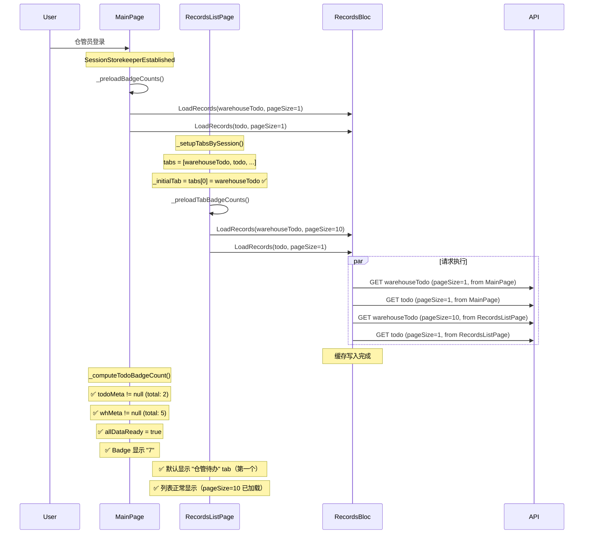
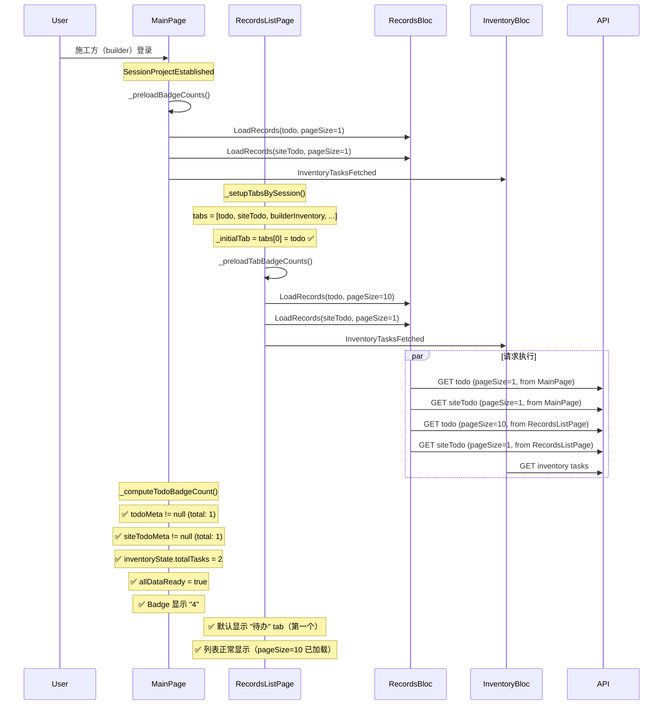

# Badge 默认 Tab 选择修复

## 问题描述

### 用户反馈的问题

1. **只有默认选中 "todo" 类型时才会自动加载 badge 数量**
   - 如果默认选中的不是 "todo"，必须手动点击 "todo" tab 才能加载 badge
   
2. **不同角色默认选中的 tab 不一致**
   - 仓管员默认选中 "仓管待办"（`warehouseTodo`），不是第一个 tab
   - 其他角色默认选中 "待办"（`todo`），是第一个 tab
   - **期望**：不管什么角色，默认选中的都应该是 `index==0` 的 tab

## 根本原因分析

### 问题1：只有 todo 能自动加载

在 `_setupTabsBySession` 中，**仓管员的默认 tab 被硬编码为 `warehouseTodo`**：

```dart
// 之前的代码（有问题）
void _setupTabsBySession(SessionState sessionState) {
  // ...
  _allTabs = tabs;

  // 根据最终的会话身份设置默认选中的tab
  if (sessionState is SessionStorekeeperEstablished && isStoreKeeper) {
    // ❌ 独立库管员身份，默认"仓管待办"优先
    _initialTab = RecordType.warehouseTodo;
  } else {
    // ✅ 其他身份，默认"待办"优先
    _initialTab = RecordType.todo;
  }
}
```

**仓管员的 tabs 顺序**：
```dart
tabs = [
  RecordType.warehouseTodo,  // index 0 (第一个)
  RecordType.todo,           // index 1
  RecordType.signinWarehouse,
  RecordType.signoutWarehouse,
];
```

所以：
- `_initialTab = RecordType.warehouseTodo`（正确，是第一个 tab）
- 但是在 `_preloadTabBadgeCounts` 中判断当前 tab 时：

```dart
// 仓管员需要预加载仓库待办
if (sessionState is SessionStorekeeperEstablished) {
  final isCurrentTab = _initialTab == RecordType.warehouseTodo;  // ✅ true
  context.read<RecordsBloc>().add(
    LoadRecords(
      recordType: RecordType.warehouseTodo,
      pageSize: isCurrentTab ? 10 : 1, // ✅ 使用 10
    ),
  );

  // 预加载普通待办（仓管员也有）
  final isTodoCurrentTab = _initialTab == RecordType.todo;  // ❌ false
  context.read<RecordsBloc>().add(
    LoadRecords(
      recordType: RecordType.todo,
      pageSize: isTodoCurrentTab ? 10 : 1, // ❌ 使用 1
    ),
  );
}
```

**实际上预加载逻辑是正确的**！但问题在于：

### 问题的真正原因

重新审视用户的描述："**只有默认选中 'todo' 类型的时候才会自动加载这个数量 badge**"

我意识到问题可能不在 RecordsListPage，而在 **MainPage 的预加载逻辑**！

让我检查 MainPage 的 `_preloadBadgeCounts`：

```dart
// MainPage._preloadBadgeCounts
void _preloadBadgeCounts(SessionState sessionState) {
  final ids = _resolveIds(sessionState);
  final int? uid = ids.$1;
  final int? pid = ids.$2;

  // 仓管员需要预加载仓库待办
  if (sessionState is SessionStorekeeperEstablished) {
    context.read<RecordsBloc>().add(
      LoadRecords(
        recordType: RecordType.warehouseTodo,
        pageSize: 1,  // ✅ 预加载仓库待办
      ),
    );
  }

  // 施工方需要预加载 todo、siteTodo
  if (sessionState is SessionProjectEstablished) {
    final role = sessionState.currentUserRoleInfo.projectRoleType;

    // 所有项目参与方都需要 todo
    context.read<RecordsBloc>().add(
      LoadRecords(
        recordType: RecordType.todo,
        pageSize: 1,  // ✅ 预加载 todo
      ),
    );
    // ...
  }
}
```

**关键发现**：MainPage 的 `_preloadBadgeCounts` **没有为仓管员预加载 todo**！

仓管员身份时：
- MainPage 只预加载 `warehouseTodo`
- RecordsListPage 预加载 `warehouseTodo`（pageSize=10）和 `todo`（pageSize=1）

但是 `_computeTodoBadgeCount` 需要同时读取 `warehouseTodo` 和 `todo` 的缓存：

```dart
// MainPage._computeTodoBadgeCount
int _computeTodoBadgeCount(...) {
  // ...
  
  // 1. 获取普通待办数量（所有角色都有）
  final todoMeta = repo.getCachedMeta(RecordType.todo, ...);
  if (todoMeta == null) {
    allDataReady = false;  // ❌ 数据还未加载
  } else {
    totalCount += todoMeta.total;
  }

  // 2. 仓管员：加上仓库待办
  if (isStorekeeper) {
    final whMeta = repo.getCachedMeta(RecordType.warehouseTodo, ...);
    if (whMeta == null) {
      allDataReady = false;
    } else {
      totalCount += whMeta.total;
    }
  }
  
  // ...
  if (!allDataReady) {
    return 0;  // ❌ 不显示 badge
  }
  return totalCount;
}
```

**问题根源**：MainPage 的 `_preloadBadgeCounts` 没有为仓管员预加载 `todo`！

### 问题2：默认 tab 不统一

这个问题很明显，代码中硬编码了不同角色的默认 tab：

```dart
// 之前的代码
if (sessionState is SessionStorekeeperEstablished && isStoreKeeper) {
  _initialTab = RecordType.warehouseTodo;  // 仓管员选 warehouseTodo
} else {
  _initialTab = RecordType.todo;  // 其他角色选 todo
}
```

但用户期望：**所有角色都默认选中第一个 tab（`_allTabs[0]`）**

## 解决方案

### 修复1：统一默认 tab 为第一个

```dart
// 修复后的代码
void _setupTabsBySession(SessionState sessionState) {
  // ... 构建 tabs 列表 ...
  
  _allTabs = tabs;

  // 🎯 修复：不管什么角色，默认选中的都是第一个tab（index==0）
  _initialTab = tabs.isNotEmpty ? tabs[0] : RecordType.todo;
}
```

**改进点**：
- ✅ 所有角色都默认选中 `_allTabs[0]`
- ✅ 仓管员默认选中 "仓管待办"（第一个 tab）
- ✅ 施工方默认选中 "待办"（第一个 tab）
- ✅ 监理方默认选中 "待办"（第一个 tab）

### 修复2：MainPage 为仓管员预加载 todo

```dart
// lib/pages/main_page.dart
void _preloadBadgeCounts(SessionState sessionState) {
  final ids = _resolveIds(sessionState);
  final int? uid = ids.$1;
  final int? pid = ids.$2;

  // 仓管员需要预加载仓库待办和普通待办
  if (sessionState is SessionStorekeeperEstablished) {
    context.read<RecordsBloc>().add(
      LoadRecords(
        recordType: RecordType.warehouseTodo,
        userId: uid,
        projectId: pid,
        pageNum: 1,
        pageSize: 1,
        tracingContext: TracingContext(
          source: 'main_page',
          action: 'preload_badge_count',
          description: '预加载仓库待办数量',
        ),
      ),
    );
    
    // 🎯 新增：预加载普通待办（仓管员也需要）
    context.read<RecordsBloc>().add(
      LoadRecords(
        recordType: RecordType.todo,
        userId: uid,
        projectId: pid,
        pageNum: 1,
        pageSize: 1,
        tracingContext: TracingContext(
          source: 'main_page',
          action: 'preload_badge_count',
          description: '预加载待办数量',
        ),
      ),
    );
  }

  // 施工方需要预加载 todo、siteTodo
  if (sessionState is SessionProjectEstablished) {
    // ... 现有逻辑保持不变 ...
  }
}
```

**改进点**：
- ✅ 仓管员现在会预加载 `warehouseTodo` 和 `todo`
- ✅ MainPage 的 badge 能正确显示（warehouseTodo + todo 的总数）

## 修改文件

### 1. lib/pages/records/records_list_page.dart

```dart
// 修改前
void _setupTabsBySession(SessionState sessionState) {
  // ...
  _allTabs = tabs;

  if (sessionState is SessionStorekeeperEstablished && isStoreKeeper) {
    _initialTab = RecordType.warehouseTodo;
  } else {
    _initialTab = RecordType.todo;
  }
}

// 修改后
void _setupTabsBySession(SessionState sessionState) {
  // ...
  _allTabs = tabs;

  // 🎯 修复：不管什么角色，默认选中的都是第一个tab（index==0）
  _initialTab = tabs.isNotEmpty ? tabs[0] : RecordType.todo;
}
```

### 2. lib/pages/main_page.dart

需要在 `_preloadBadgeCounts` 方法中为仓管员添加 todo 的预加载。

## 执行流程（修复后）

### 场景1：仓管员登录



### 场景2：施工方登录



## 关键改进

### 1. 统一的默认 tab 选择

**之前**：
- 仓管员：默认 `warehouseTodo`（可能不是第一个）
- 其他角色：默认 `todo`（可能不是第一个）

**修复后**：
- **所有角色**：默认 `_allTabs[0]`（**一定是第一个 tab**）

### 2. MainPage 完整的预加载逻辑

**之前**：
- 仓管员：只预加载 `warehouseTodo`，**缺少 `todo`**
- MainPage badge 需要两者都有才能显示

**修复后**：
- 仓管员：预加载 `warehouseTodo` **和** `todo`
- MainPage badge 能正确显示总数

### 3. RecordsListPage 智能的 pageSize

**保持不变**（逻辑正确）：
- 当前激活的 tab：使用 `pageSize=10`（加载完整列表）
- 其他需要 badge 的 tab：使用 `pageSize=1`（仅获取 total）

## 测试场景

### 基本功能测试

1. ✅ 仓管员登录
   - 默认显示 "仓管待办" tab（第一个）
   - 列表正常显示
   - MainPage badge 显示正确（warehouseTodo + todo）

2. ✅ 施工方登录
   - 默认显示 "待办" tab（第一个）
   - 列表正常显示
   - MainPage badge 显示正确（todo + siteTodo + builderInventory）

3. ✅ 监理方登录
   - 默认显示 "待办" tab（第一个）
   - 列表正常显示
   - MainPage badge 显示正确（todo）

### 项目切换测试

1. ✅ 施工方 → 监理方
   - 默认显示 "待办" tab（第一个）
   - Badge 正确切换

2. ✅ 施工方 → 仓管员
   - 默认显示 "仓管待办" tab（第一个）
   - Badge 正确切换

### Badge 显示测试

1. ✅ 所有角色登录后，badge 立即显示（不需要手动点击 tab）
2. ✅ 项目切换后，badge 立即更新（不需要手动点击 tab）
3. ✅ 不同 tab 的 badge 数量独立计算，互不干扰

---

**修复日期**：2025-08-01  
**相关文档**：
- [BADGE_PROJECT_SWITCH_DUPLICATE_REQUESTS_FIX.md](./BADGE_PROJECT_SWITCH_DUPLICATE_REQUESTS_FIX.md)（重复请求修复）
- [BADGE_PROJECT_SWITCH_CACHE_FIX.md](./BADGE_PROJECT_SWITCH_CACHE_FIX.md)（缓存清空策略）
- [BADGE_LOADING_OPTIMIZATION.md](./BADGE_LOADING_OPTIMIZATION.md)（数据完整性检查）
