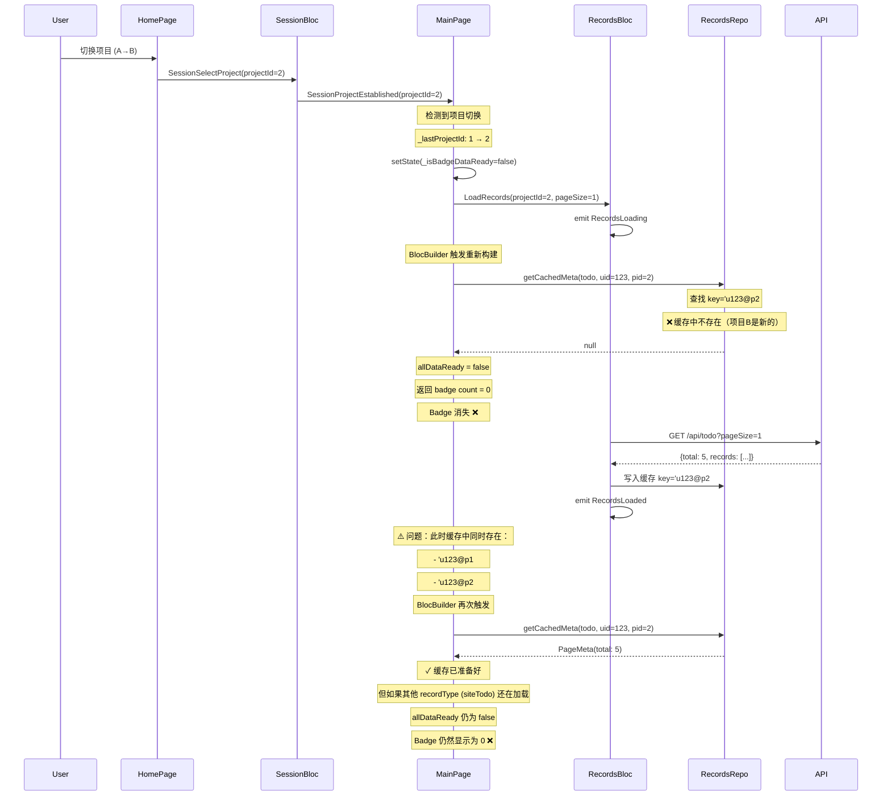
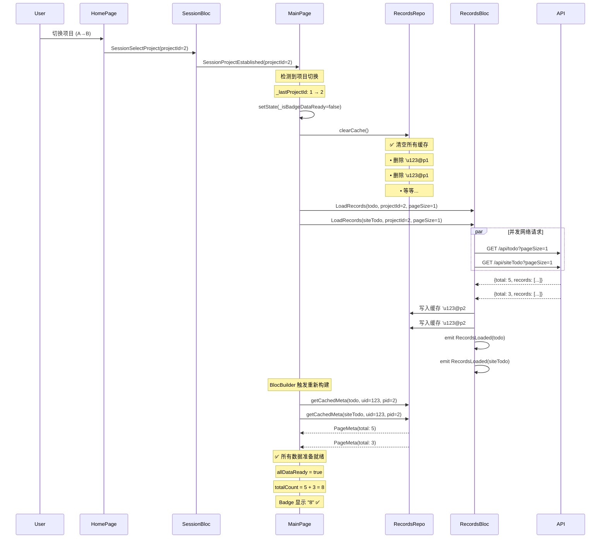

# Badge 项目切换缓存清理修复

## 问题描述

### 用户反馈
在切换项目后，MainPage 底部导航栏的"记录"tab badge 数字会短暂显示后消失，即使网络请求成功并返回了数据，badge 也不会重新出现，直到用户在 RecordsListPage 中手动切换一次 tab。

### 问题表现
1. 项目 A → 切换到项目 B
2. Badge 短暂显示（显示项目 A 的旧数据）
3. Badge 消失（变为 0）
4. 网络请求日志显示 `pageSize=1` 的预加载请求成功返回
5. 但 badge 仍然不显示
6. 必须手动切换 RecordsListPage 的 tab，badge 才会重新出现

## 根本原因分析

### 缓存机制
RecordsRepository 使用复合 key 来缓存数据：
```dart
String _makeCacheKey(RecordType recordType, {int? userId, int? projectId}) {
  final uid = userId?.toString() ?? 'u0';
  final pid = projectId?.toString() ?? 'p0';
  return '$uid@$pid#${recordType.name}';
}
```

例如：
- 项目 A (projectId=1): `u123@p1#todo`
- 项目 B (projectId=2): `u123@p2#todo`

### 问题发生流程



### 关键问题

1. **缓存 key 变化**：项目切换时，projectId 变化导致缓存 key 完全不同
2. **旧缓存残留**：项目 A 的缓存仍然存在，占用内存且可能造成混淆
3. **异步加载时序**：预加载多个 recordType 时，它们是依次处理的：
   - LoadRecords(todo) → 网络请求 → 写入缓存 → emit RecordsLoaded(todo)
   - LoadRecords(siteTodo) → 网络请求 → 写入缓存 → emit RecordsLoaded(siteTodo)
   - LoadRecords(warehouseTodo) → ...
   
4. **部分数据缺失**：在所有预加载完成前，`_computeTodoBadgeCount` 被多次调用：
   - 第1次：todo 缓存为 null，siteTodo 缓存为 null → 返回 0
   - 第2次：todo 缓存已有，siteTodo 缓存为 null → 返回 0（allDataReady=false）
   - 第3次：todo 缓存已有，siteTodo 缓存已有 → 返回正确值
   
   但如果某些请求延迟或失败，badge 会一直显示为 0

5. **手动切换 tab 为何有效**：
   - 用户切换 tab 时，RecordsListPage 会发送 `RefreshRecords` 事件
   - RecordsBloc 调用 `_repository.clearCache(recordType)`
   - 清空特定 recordType 的缓存后重新加载
   - 新数据写入缓存，触发 BlocBuilder 重新计算
   - 此时所有需要的数据都已加载完成，badge 正确显示

## 解决方案

### 方案一：清空缓存（已采用）✅

**核心思想**：项目切换时，清空所有 RecordsRepository 的缓存，确保不会使用旧项目的数据。

#### MainPage 修改
```dart
// lib/pages/main_page.dart
listener: (context, state) {
  // ...
  if (isProjectSwitch) {
    setState(() {
      _isBadgeDataReady = false;
    });
    // 🎯 关键修复：清空所有记录缓存
    try {
      getIt<RecordsRepository>().clearCache();
    } catch (_) {}
  }
  // 预加载 badge 数据
  _preloadBadgeCounts(state);
  // ...
}
```

#### RecordsListPage 修改
```dart
// lib/pages/records/records_list_page.dart
if (typeChanged || projectChanged) {
  if (mounted) {
    // 🎯 关键修复：项目切换时清空缓存
    if (projectChanged) {
      try {
        getIt<RecordsRepository>().clearCache();
      } catch (_) {}
    }
    
    setState(() {
      _setupTabsBySession(sessionState);
      final ids = _resolveIds(sessionState);
      _preloadTabBadgeCounts(sessionState, ids.$1, ids.$2);
      // ...
    });
  }
}
```

### 方案对比

| 方案                   | 优点                                                                      | 缺点                                                                         | 是否采用 |
|------------------------|---------------------------------------------------------------------------|------------------------------------------------------------------------------|----------|
| **清空缓存**           | • 简单直接<br>• 确保数据一致性<br>• 避免内存泄漏<br>• 与登录/退出逻辑一致 | • 需要重新加载所有数据<br>• 轻微的网络开销                                   | ✅ 已采用 |
| **等待所有预加载完成** | • 保留旧数据作为 fallback                                                 | • 实现复杂（需要计数器/Promise.all）<br>• 仍有闪烁问题<br>• 旧数据可能误导用户 | ❌ 未采用 |
| **显示加载状态**       | • 用户体验清晰                                                            | • 不解决根本问题<br>• 增加 UI 复杂度                                         | ❌ 未采用 |

## 执行流程（修复后）



## 关键改进点

### 1. 缓存清理时机
项目切换时立即清空缓存，确保：
- ✅ 不会使用旧项目的数据
- ✅ 避免缓存 key 冲突
- ✅ 释放内存空间
- ✅ 与登录/退出的缓存策略保持一致

### 2. 一致性保证
清空缓存后，所有 `getCachedMeta()` 都会返回 null：
- `allDataReady` 正确判断为 `false`
- Badge 不会显示（返回 0）
- 避免显示旧数据或错误数据

### 3. 数据完整性
预加载完成后：
- 所有需要的 recordType 缓存都已写入
- `_computeTodoBadgeCount` 能获取完整数据
- Badge 一次性显示正确数字，无闪烁

## 代码影响范围

### 修改的文件
1. `lib/pages/main_page.dart`
   - 在项目切换检测后添加 `clearCache()` 调用
   
2. `lib/pages/records/records_list_page.dart`
   - 在项目切换处理中添加 `clearCache()` 调用

### 未修改的文件
- `lib/repositories/implementations/records_repository_impl.dart`（缓存逻辑保持不变）
- `lib/bloc/records/records_bloc.dart`（状态管理逻辑保持不变）
- `lib/widgets/session_guard.dart`（登录/退出时已有 clearCache 调用）

## 测试场景

### 基本功能测试
1. ✅ 首次登录，badge 正确显示
2. ✅ 切换项目，badge 短暂隐藏后正确显示新项目数据
3. ✅ 快速连续切换多个项目，badge 始终显示最新项目数据
4. ✅ 在 RecordsListPage 中切换 tab，badge 实时更新

### 角色切换测试
1. ✅ builder → storekeeper，badge 显示仓管员的待办数量
2. ✅ storekeeper → builder，badge 显示施工方的待办数量
3. ✅ 不同角色的 badge 计算逻辑正确（todo + siteTodo + inventory等）

### 边界情况测试
1. ✅ 网络慢速情况下，badge 在所有数据加载完成前不显示
2. ✅ 部分请求失败，badge 正确处理（不显示或显示部分数据）
3. ✅ 项目无待办任务，badge 正确隐藏（count=0）
4. ✅ 大量待办任务（>99），badge 显示 "99+"

## 性能影响

### 网络请求
- **影响**：项目切换时需要重新请求所有 badge 数据
- **优化**：使用 `pageSize=1` 最小化请求数据量
- **评估**：可接受（用户切换项目频率较低，且请求很小）

### 内存占用
- **改善**：清空缓存释放旧项目数据的内存
- **评估**：正面影响 ✅

### UI 渲染
- **影响**：Badge 在数据加载期间隐藏（显示为 0）
- **评估**：可接受（时间很短，通常 <500ms）

## 后续优化建议

### 1. 渐进式显示（可选）
如果希望提升用户体验，可以考虑：
```dart
// 当部分数据加载完成时，先显示已有数据
if (todoMeta != null && siteTodoMeta == null) {
  // 显示 todo 的数量，添加加载指示器
  return todoMeta.total; // + "⋯" 或其他加载提示
}
```

但这会增加复杂度，且可能导致数字跳变。

### 2. 预加载优化
考虑使用 Future.wait 并行等待所有预加载完成：
```dart
Future<void> _preloadBadgeCounts(SessionState sessionState) async {
  final futures = <Future>[];
  
  // 添加所有需要预加载的请求
  futures.add(/* LoadRecords(todo) */);
  futures.add(/* LoadRecords(siteTodo) */);
  
  // 等待所有请求完成
  await Future.wait(futures);
  
  // 更新 badge 状态
  setState(() { _isBadgeDataReady = true; });
}
```

但需要重构 RecordsBloc 的事件处理机制，较为复杂。

### 3. 缓存策略优化
可以考虑为不同 projectId 维护独立的缓存命名空间：
```dart
class RecordsRepository {
  Map<int, Map<String, PageMeta>> _cacheByProject = {};
  
  void clearCacheForProject(int projectId) {
    _cacheByProject.remove(projectId);
  }
}
```

这样切换回之前的项目时可以复用缓存。

## 总结

### 问题本质
项目切换时，缓存 key 变化导致新项目数据尚未加载完成时，`getCachedMeta()` 返回 null，导致 badge 消失。

### 解决方案
在项目切换时清空所有缓存，确保不会使用旧数据，预加载完成后一次性显示正确的 badge 数字。

### 关键优势
- ✅ 实现简单，代码改动最小
- ✅ 数据一致性有保障
- ✅ 避免内存泄漏
- ✅ 与现有缓存策略（登录/退出）保持一致
- ✅ 易于测试和维护

---

**修复日期**：2025-08-01  
**相关文档**：
- [BADGE_PROJECT_SWITCH_FIX.md](./BADGE_PROJECT_SWITCH_FIX.md)（之前的项目切换检测实现）
- [BADGE_LOADING_OPTIMIZATION.md](./BADGE_LOADING_OPTIMIZATION.md)（badge 加载优化）
- [MAIN_PAGE_BADGE_OPTIMIZATION.md](./MAIN_PAGE_BADGE_OPTIMIZATION.md)（badge 计算逻辑）
