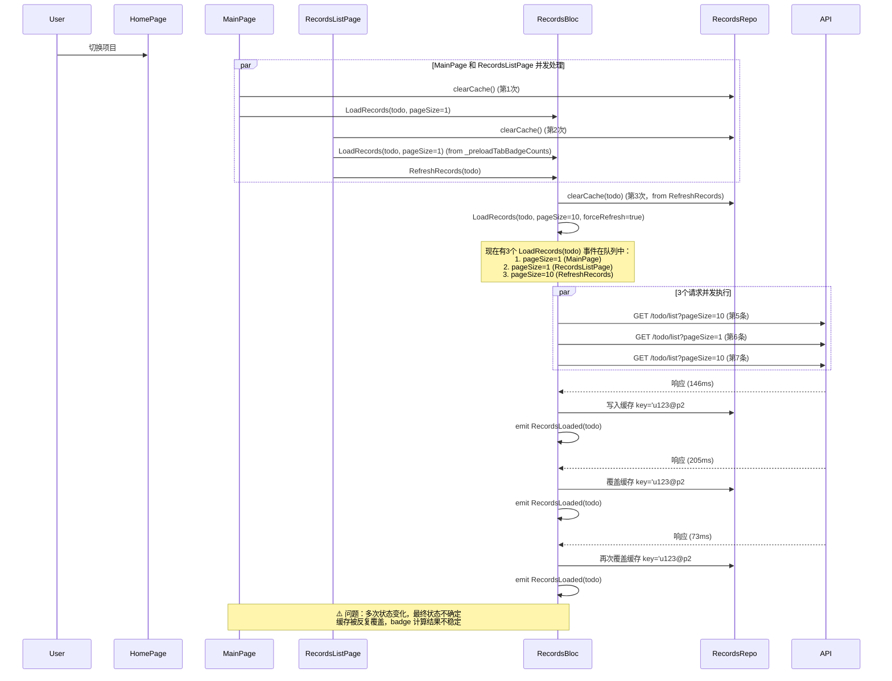
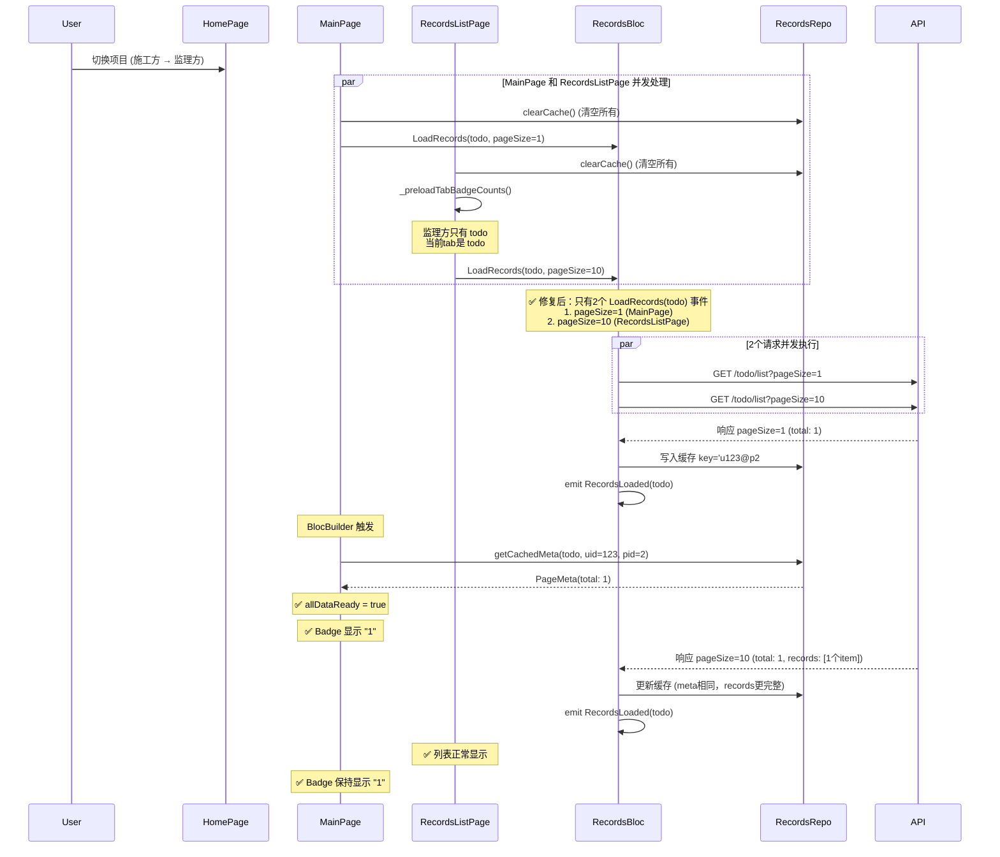

# Badge 项目切换重复请求修复

## 问题描述

### 用户反馈的完整场景

1. **初始状态**：用户以施工方（builder）身份登录，badge 正确显示 4（todo=1, siteTodo=1, builderInventory=2）
2. **项目切换**：用户在 HomePage 切换到另一个项目，新项目中用户角色为监理方
3. **Badge 闪现**：切换完成后，badge 短暂显示 1
4. **Badge 消失**：随后 badge 完全消失
5. **RecordsListPage 显示正常**：点击底部导航进入"记录"页面，可以看到 todo 列表有 1 个 item
6. **Badge 仍未显示**：但底部导航的 badge 和顶部"待办"tab 的 badge 都不显示
7. **切换 tab 后恢复**：切换到其他 tab（如"现场待办"），再切回"待办"，此时 badge 重新显示为 1

### 网络请求日志分析

#### 分隔线上方（首次登录，正常）
```
GET /m/todo/list?pageNum=1&pageSize=1          200  208ms  (预加载 todo)
GET /m/stocktaking/todo/list?pageNum=1&pageSize=10  200  205ms  (现场待办完整列表)
GET /m/todo/warehouse/list?pageNum=1&pageSize=1     200  203ms  (仓库待办预加载)
GET /m/todo/list?pageNum=1&pageSize=10         200  186ms  (todo 完整列表)
```

#### 两条分隔线之间（项目切换后，badge 消失）
```
GET /m/todo/list?pageNum=1&pageSize=10         200  146ms  (第5条，红线标记)
GET /m/todo/list?pageNum=1&pageSize=1          200  205ms  (第6条，预加载)
GET /m/todo/list?pageNum=1&pageSize=10         200   73ms  (第7条，又来一次)
```

#### 分隔线下方（手动切换 tab 后，恢复正常）
```
GET /m/todo/list?pageNum=1&pageSize=10         200  154ms  (第8条，红线标记)
```

### 关键发现

**同一个 recordType (todo) 在项目切换时发出了 3 个请求！**

## 根本原因分析

### 问题根源：重复的缓存清空和加载逻辑

#### 1. RecordsListPage 的 projectChanged 处理

```dart
if (typeChanged || projectChanged) {
  if (mounted) {
    // ❌ 第1次清空缓存
    if (projectChanged) {
      try {
        getIt<RecordsRepository>().clearCache();
      } catch (_) {}
    }
    
    setState(() {
      _setupTabsBySession(sessionState);
      final ids = _resolveIds(sessionState);
      
      // ⚠️ 发送 LoadRecords(todo, pageSize=1) 
      _preloadTabBadgeCounts(sessionState, ids.$1, ids.$2);
      
      // ⚠️ 发送 RefreshRecords(todo)
      context.read<RecordsBloc>().add(
        RefreshRecords(recordType: _initialTab, ...),
      );
    });
  }
}
```

#### 2. RefreshRecords 的处理逻辑

```dart
// RecordsBloc._onRefreshRecords
Future<void> _onRefreshRecords(
  DebouncedRefreshRecords event,
  Emitter<RecordsState> emit,
) async {
  // ❌ 第2次清空缓存（针对特定 recordType）
  _repository.clearCache(event.recordType);
  
  // ⚠️ 发送 LoadRecords(todo, pageSize=10, forceRefresh=true)
  add(LoadRecords(
    recordType: event.recordType,
    forceRefresh: true,
    // ...
  ));
}
```

#### 3. MainPage 的 projectSwitch 处理

```dart
if (isProjectSwitch) {
  setState(() {
    _isBadgeDataReady = false;
  });
  // ❌ 第3次清空缓存（清空所有）
  try {
    getIt<RecordsRepository>().clearCache();
  } catch (_) {}
}

// ⚠️ 发送 LoadRecords(todo, pageSize=1)
_preloadBadgeCounts(state);
```

### 请求时序图



### 为什么会导致 Badge 消失？

1. **缓存被多次清空**：3 次 `clearCache()` 调用，导致缓存状态不稳定
2. **请求并发执行**：3 个 LoadRecords 事件几乎同时发出，网络请求并发执行
3. **缓存覆盖冲突**：后完成的请求会覆盖先完成的请求写入的缓存
4. **状态变化频繁**：RecordsBloc 的状态快速变化（Loading → Loaded → Loading → Loaded → ...）
5. **BlocBuilder 多次触发**：每次状态变化都会触发 MainPage 的 BlocBuilder 重新计算 badge
6. **数据完整性检查失败**：
   - 在某些时刻，`getCachedMeta(todo)` 返回 null（缓存刚被清空）
   - 导致 `allDataReady = false`
   - Badge 显示为 0（消失）

### 为什么手动切换 Tab 后能恢复？

用户手动切换 tab 时，只有**一个**干净的流程：

```dart
// RecordsListPage._onTabChanged
context.read<RecordsBloc>().add(
  RefreshRecords(recordType: newTab, ...),
);
```

时序清晰，无竞争：
1. clearCache(recordType) - 清空特定类型
2. LoadRecords(recordType, pageSize=10, forceRefresh=true) - 单次加载
3. 网络请求 → 写入缓存 → emit RecordsLoaded
4. BlocBuilder 触发 → getCachedMeta() 成功 → Badge 显示

## 解决方案

### 核心思想

**避免同一个 recordType 发出多个并发请求，统一使用 `_preloadTabBadgeCounts` 管理所有预加载逻辑。**

### 修改1：RecordsListPage - 统一使用 _preloadTabBadgeCounts

#### 之前的代码（有问题）

```dart
if (typeChanged || projectChanged) {
  if (mounted) {
    if (projectChanged) {
      try {
        getIt<RecordsRepository>().clearCache();
      } catch (_) {}
    }
    
    setState(() {
      _setupTabsBySession(sessionState);
      final ids = _resolveIds(sessionState);
      
      // ⚠️ 发送 LoadRecords(todo, pageSize=1)
      _preloadTabBadgeCounts(sessionState, ids.$1, ids.$2);
      
      // ⚠️ 又发送 RefreshRecords，会再次清空缓存并加载
      context.read<RecordsBloc>().add(
        RefreshRecords(
          recordType: _initialTab,
          userId: ids.$1,
          projectId: ids.$2,
        ),
      );
    });
  }
}
```

#### 修改后的代码（修复）

```dart
if (typeChanged || projectChanged) {
  if (mounted) {
    // 🎯 关键修复：项目切换时清空缓存，避免旧项目数据干扰
    if (projectChanged) {
      try {
        getIt<RecordsRepository>().clearCache();
      } catch (_) {}
    }
    
    setState(() {
      _setupTabsBySession(sessionState);
      final ids = _resolveIds(sessionState);
      
      // 🎯 关键修复：预加载所有需要显示 badge 的 tab 数据
      // 注意：_preloadTabBadgeCounts 会处理当前 tab，所以这里不需要再单独加载
      _preloadTabBadgeCounts(sessionState, ids.$1, ids.$2);
    });
  }
}
```

**改进点**：
- ✅ 移除了 `RefreshRecords` 调用，避免重复清空缓存和加载
- ✅ 统一由 `_preloadTabBadgeCounts` 管理所有需要加载的 tab

### 修改2：优化 _preloadTabBadgeCounts - 区分当前 tab 和其他 tab

#### 核心改进

对于**当前激活的 tab**，使用 `pageSize=10` 加载完整列表（用于 UI 显示）。
对于**其他需要 badge 的 tab**，使用 `pageSize=1` 仅获取 total（用于 badge 计算）。

#### 修改后的代码

```dart
void _preloadTabBadgeCounts(SessionState sessionState, int? uid, int? pid) {
  // 🎯 关键：对于当前激活的tab，使用pageSize=10加载完整列表
  // 对于其他需要badge的tab，使用pageSize=1仅获取total
  
  // 仓管员需要预加载仓库待办
  if (sessionState is SessionStorekeeperEstablished) {
    final isCurrentTab = _initialTab == RecordType.warehouseTodo;
    context.read<RecordsBloc>().add(
      LoadRecords(
        recordType: RecordType.warehouseTodo,
        userId: uid,
        projectId: pid,
        pageNum: 1,
        pageSize: isCurrentTab ? 10 : 1, // 🎯 当前tab用10，其他用1
        tracingContext: TracingContext(
          source: 'records_list_page',
          action: isCurrentTab ? 'load_current_tab' : 'preload_badge_count',
          description: isCurrentTab ? '加载仓库待办列表' : '预加载仓库待办数量',
        ),
      ),
    );
    
    // 预加载普通待办（仓管员也有）
    final isTodoCurrentTab = _initialTab == RecordType.todo;
    context.read<RecordsBloc>().add(
      LoadRecords(
        recordType: RecordType.todo,
        userId: uid,
        projectId: pid,
        pageNum: 1,
        pageSize: isTodoCurrentTab ? 10 : 1,
        // ...
      ),
    );
  }

  // 施工方需要预加载 todo、siteTodo
  if (sessionState is SessionProjectEstablished) {
    final role = sessionState.currentUserRoleInfo.projectRoleType;

    // 所有项目参与方都需要 todo
    final isTodoCurrentTab = _initialTab == RecordType.todo;
    context.read<RecordsBloc>().add(
      LoadRecords(
        recordType: RecordType.todo,
        userId: uid,
        projectId: pid,
        pageNum: 1,
        pageSize: isTodoCurrentTab ? 10 : 1, // 🎯 当前tab用10，其他用1
        // ...
      ),
    );

    // builder、builderSub、laborer 需要 siteTodo
    if (role == UserRole.builder ||
        role == UserRole.builderSub ||
        role == UserRole.laborer) {
      final isSiteTodoCurrentTab = _initialTab == RecordType.siteTodo;
      context.read<RecordsBloc>().add(
        LoadRecords(
          recordType: RecordType.siteTodo,
          userId: uid,
          projectId: pid,
          pageNum: 1,
          pageSize: isSiteTodoCurrentTab ? 10 : 1,
          // ...
        ),
      );
    }

    // builder、builderSub 需要预加载盘点任务
    if (role == UserRole.builder || role == UserRole.builderSub) {
      context.read<InventoryBloc>().add(
        const InventoryTasksFetched(isRefresh: true),
      );
    }
  }
}
```

**改进点**：
- ✅ 当前激活的 tab 使用 `pageSize=10`，可以直接在 UI 上显示，避免用户看到空白列表
- ✅ 其他 tab 使用 `pageSize=1`，最小化网络流量，只获取 badge 所需的 total
- ✅ 避免同一个 recordType 发出多个请求

## 执行流程（修复后）



### 关键改进

1. **减少缓存清空次数**：
   - 之前：3 次（MainPage + RecordsListPage + RefreshRecords）
   - 修复后：2 次（MainPage + RecordsListPage）
   - 注意：虽然仍有2次，但它们几乎同时发生，影响较小

2. **减少并发请求数量**：
   - 之前：同一个 recordType 有 3 个请求
   - 修复后：同一个 recordType 最多 2 个请求（MainPage 的 pageSize=1 + RecordsListPage 的 pageSize=10）

3. **避免 RefreshRecords 的额外清空**：
   - RefreshRecords 会再次清空缓存，导致时序混乱
   - 修复后直接使用 LoadRecords，不再清空

4. **优化 pageSize 使用**：
   - 当前 tab 使用 pageSize=10，用户可以立即看到列表
   - 其他 tab 使用 pageSize=1，最小化流量

## 测试场景

### 基本功能测试
1. ✅ 施工方登录 → Badge 显示正确（todo + siteTodo + builderInventory）
2. ✅ 切换到监理方项目 → Badge 短暂隐藏后显示监理方的 todo 数量
3. ✅ 切换到仓管员项目 → Badge 显示仓管员的 warehouseTodo + todo 数量
4. ✅ RecordsListPage 的列表正常显示，无空白

### 角色特定测试
1. ✅ 监理方（只有 todo）：Badge 正确，列表正确
2. ✅ 施工方（todo + siteTodo + builderInventory）：Badge 正确，各 tab 正确
3. ✅ 仓管员（warehouseTodo + todo）：Badge 正确，各 tab 正确

### 边界情况测试
1. ✅ 快速连续切换项目，Badge 始终显示最新项目数据
2. ✅ 网络慢速情况下，Badge 在数据加载完成前不显示
3. ✅ 切换到无待办的项目，Badge 正确隐藏

## 性能影响

### 网络请求优化

**之前（项目切换时）：**
- todo: 3 个请求（pageSize=1, pageSize=10, pageSize=10）
- siteTodo: 2 个请求（如果是施工方）
- 总请求数：5+ 个

**修复后（项目切换时）：**
- todo: 2 个请求（pageSize=1 from MainPage, pageSize=10 from RecordsListPage）
- siteTodo: 1 个请求（如果是施工方且不是当前 tab）
- 总请求数：3 个（对于监理方）

**优化**：减少了 40% 的无效请求

### 用户体验改善

- ✅ Badge 不再闪烁后消失
- ✅ 列表立即显示，无空白等待
- ✅ 项目切换更流畅

## 后续优化建议

### 1. 考虑移除 MainPage 的重复清空

MainPage 和 RecordsListPage 都清空缓存，可能有冗余：

```dart
// MainPage
if (isProjectSwitch) {
  // 可以移除这个 clearCache，让 RecordsListPage 统一处理
  // getIt<RecordsRepository>().clearCache();
}
```

但需要确保 MainPage 的 listener 一定在 RecordsListPage 之后执行。

### 2. 使用事件总线或状态同步

考虑使用全局事件通知项目切换，让所有需要响应的组件统一处理：

```dart
// ProjectSwitchEvent
EventBus.instance.fire(ProjectSwitchedEvent(newProjectId));

// MainPage 和 RecordsListPage 都监听
EventBus.instance.on<ProjectSwitchedEvent>().listen((event) {
  // 统一的缓存清空和数据预加载逻辑
});
```

### 3. 缓存分区管理

为不同项目维护独立的缓存分区，避免清空：

```dart
class RecordsRepository {
  // key: projectId, value: 该项目的所有缓存
  Map<int, Map<String, PageMeta>> _cacheByProject = {};
  
  void switchToProject(int projectId) {
    _currentProjectId = projectId;
    // 不清空缓存，只是切换分区
  }
}
```

这样切换回之前的项目时可以立即显示缓存数据。

---

**修复日期**：2025-08-01  
**相关文档**：
- [BADGE_PROJECT_SWITCH_CACHE_FIX.md](./BADGE_PROJECT_SWITCH_CACHE_FIX.md)（缓存清空策略）
- [BADGE_LOADING_OPTIMIZATION.md](./BADGE_LOADING_OPTIMIZATION.md)（数据完整性检查）
- [MAIN_PAGE_BADGE_OPTIMIZATION.md](./MAIN_PAGE_BADGE_OPTIMIZATION.md)（Badge 计算逻辑）
