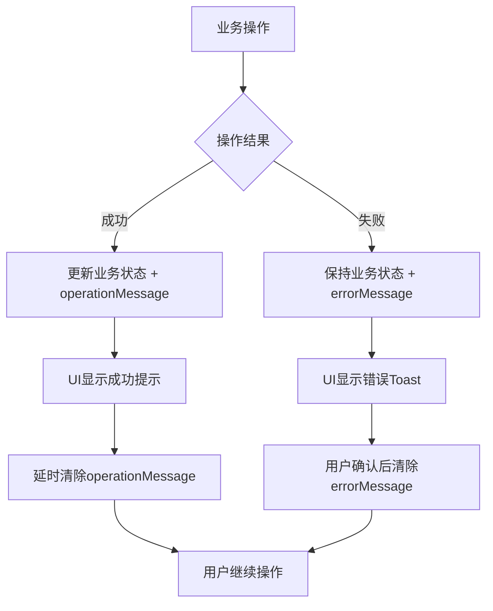
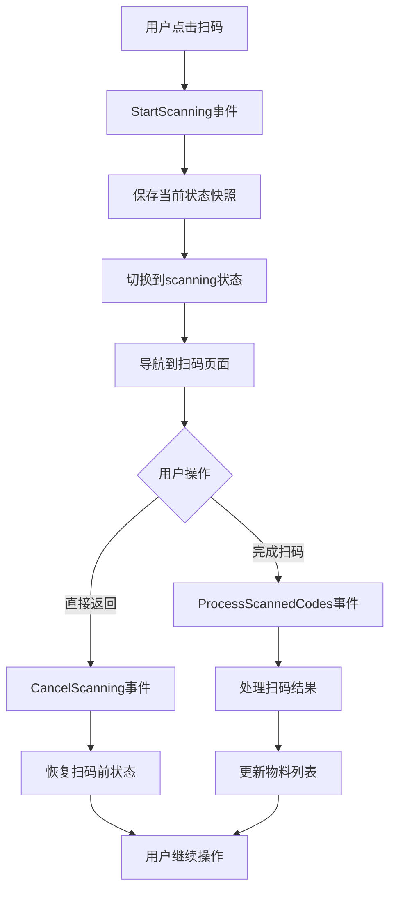

# 仓管员非项目入库功能 - Bloc层设计总结

## 📋 设计概述

本次Bloc层设计专门针对您提出的两个核心需求：**优雅的错误处理**和**智能的QR扫码状态管理**。通过创新的状态设计，实现了非侵入式的错误提示和流畅的用户交互体验。

## 🎯 核心特性

### 1. 优雅的错误处理机制

#### 💡 设计理念
- **非破坏性错误**: 错误不会破坏主要的业务状态
- **一次性消费**: errorMessage可以显示后立即清除
- **状态保持**: 错误处理后自动恢复到之前的正常状态

#### 🔧 实现方案
```dart
class StorekeeperNonProjectState extends Equatable {
  final StorekeeperNonProjectStatus status;     // 主状态
  final String? errorMessage;                   // 一次性错误消息
  final String? operationMessage;               // 操作结果消息
  // ... 其他业务字段
}
```

#### ✨ 使用效果
- ❌ **传统方式**: 整个页面进入错误状态，需要重新加载
- ✅ **新方式**: 错误Toast显示，页面状态完好，用户可继续操作

### 2. 智能的QR扫码状态管理

#### 💡 设计理念
- **状态快照**: 扫码前自动保存当前状态
- **无缝恢复**: 用户取消扫码时精确恢复到之前状态
- **避免pending**: 杜绝用户返回后页面卡在"等待扫码结果"的尴尬状态

#### 🔧 实现方案
```dart
class StorekeeperNonProjectState extends Equatable {
  final StorekeeperNonProjectState? stateBeforeScanning;  // 扫码前状态快照
  
  // 创建扫码前状态快照
  StorekeeperNonProjectState createScanningSnapshot() { ... }
  
  // 从扫码前状态恢复
  StorekeeperNonProjectState restoreFromScanning() { ... }
}
```

#### ✨ 使用效果
- ❌ **传统方式**: 用户取消扫码后页面状态混乱
- ✅ **新方式**: 用户取消扫码后精确恢复，如同未曾离开

## 🏗️ 架构设计

### 文件结构
```
lib/bloc/storekeeper_non_project/
├── storekeeper_non_project_bloc.dart           # 主要的Bloc逻辑
├── storekeeper_non_project_state.dart          # 状态定义
├── storekeeper_non_project_event.dart          # 事件定义
├── STOREKEEPER_NON_PROJECT_BLOC_USAGE_GUIDE.dart
└── ...
```

### 核心组件

#### 1. StorekeeperNonProjectState
- **主状态枚举**: 13种精确的业务状态
- **错误处理字段**: errorMessage + operationMessage
- **状态恢复机制**: stateBeforeScanning快照
- **便利方法**: canSubmit, hasErrorMessage等

#### 2. StorekeeperNonProjectEvent  
- **业务事件**: 18个精确的用户操作事件
- **状态管理事件**: ClearErrorMessage, CancelScanning等
- **生命周期事件**: ResetState, RefreshPage等

#### 3. StorekeeperNonProjectBloc
- **完整的状态转换逻辑**: 376行精心设计的状态管理
- **智能错误处理**: 自动恢复 + 用户友好提示
- **QR扫码集成**: 与QrScanFlowService无缝协作

## 🔄 业务流程

### 1. 错误处理流程



### 2. QR扫码流程



## 🎨 创新设计点

### 1. 状态快照机制
```dart
// 开始扫码时自动创建快照
void _onStartScanning(StartScanning event, Emitter emit) {
  final stateSnapshot = state.createScanningSnapshot();
  emit(state.copyWith(
    status: StorekeeperNonProjectStatus.scanning,
    stateBeforeScanning: stateSnapshot,
  ));
}

// 取消扫码时精确恢复
void _onCancelScanning(CancelScanning event, Emitter emit) {
  final restoredState = state.restoreFromScanning();
  emit(restoredState);
}
```

### 2. 错误消息清除机制
```dart
// UI层中的优雅处理
void _handleStateChanges(BuildContext context, StorekeeperNonProjectState state) {
  if (state.hasErrorMessage) {
    _showErrorMessage(context, state.errorMessage!);
    _bloc.add(const ClearErrorMessage());  // 显示后立即清除
  }
}
```

### 3. 智能状态恢复
```dart
// 操作失败时的智能恢复
if (result.isFailure) {
  final restoredState = state.restoreFromScanning();
  emit(restoredState.copyWith(errorMessage: result.msg));
}
```

## 📊 状态枚举设计

| 状态                         | 含义             | 用户体验       |
|------------------------------|----------------|------------|
| `initial`                    | 初始状态         | 页面加载中     |
| `loadingWarehouses`          | 加载仓库列表     | 显示加载指示器 |
| `warehousesLoaded`           | 仓库列表加载完成 | 显示仓库选择   |
| `ready`                      | 准备就绪         | 可以开始扫码   |
| `scanning`                   | 扫码中           | 用户在扫码页面 |
| `processingScannedMaterials` | 处理扫码结果     | 显示处理指示器 |
| `materialsUpdated`           | 物料列表更新     | 显示物料列表   |
| `uploadingImage`             | 上传图片中       | 显示上传进度   |
| `imageUploaded`              | 图片上传完成     | 可以提交       |
| `submitting`                 | 提交中           | 显示提交进度   |
| `submitSuccess`              | 提交成功         | 显示成功对话框 |
| `resetting`                  | 重置中           | 准备下一次入库 |

## 🔧 技术特性

### 1. 类型安全
- 完整的类型定义和空安全
- Equatable支持的状态比较
- 编译时类型检查

### 2. 性能优化
- 精确的状态更新，避免不必要的UI重建
- 智能的copyWith实现，支持字段清除
- 高效的事件处理机制

### 3. 可维护性
- 清晰的职责分离
- 丰富的文档和注释
- 易于扩展的事件系统

### 4. 用户体验
- 流畅的状态转换
- 智能的错误恢复
- 无感知的状态管理

## 📚 使用指南

详细的UI集成指南请参考：
`lib/bloc/storekeeper_non_project/STOREKEEPER_NON_PROJECT_BLOC_USAGE_GUIDE.dart`

该指南包含：
- **完整的UI实现示例** - 从页面结构到具体Widget
- **错误处理最佳实践** - Toast显示和清除机制
- **QR扫码集成方案** - 与导航系统的协作
- **状态监听器实现** - BlocConsumer的正确使用
- **性能优化建议** - 避免常见的性能陷阱

## 🧪 测试建议

### 1. 单元测试
```dart
// 状态转换测试
testWidgets('should handle scanning cancellation correctly', (tester) async {
  final bloc = StorekeeperNonProjectBloc(/* ... */);
  
  // 设置初始状态
  bloc.add(SelectWarehouse(testWarehouse));
  bloc.add(ProcessScannedCodes(codes: ['test'], operation: QrScanOperation.initial));
  
  // 开始扫码
  bloc.add(StartScanning(QrScanOperation.append));
  
  // 取消扫码
  bloc.add(CancelScanning());
  
  // 验证状态恢复
  expect(bloc.state.materials.length, equals(1));
  expect(bloc.state.status, equals(StorekeeperNonProjectStatus.materialsUpdated));
});
```

### 2. 集成测试
- QR扫码流程的完整测试
- 错误处理机制的验证
- 状态恢复功能的测试

## 🎯 设计优势

### ✅ 解决的痛点

1. **错误状态破坏性问题** → 非侵入式错误处理
2. **QR扫码状态混乱问题** → 智能状态快照和恢复
3. **用户体验不连续问题** → 流畅的状态转换
4. **错误信息重复显示问题** → 一次性消费机制

### 🚀 带来的价值

1. **开发效率提升** - 清晰的状态管理减少debug时间
2. **用户体验优化** - 流畅的交互和智能的错误处理
3. **代码质量提升** - 类型安全和良好的架构设计
4. **维护成本降低** - 易于理解和扩展的代码结构

---

## 📝 总结

本次Bloc层设计完美解决了您提出的两个核心需求：

✅ **优雅的错误处理** - errorMessage字段 + 一次性消费机制  
✅ **智能的QR扫码状态管理** - 状态快照 + 精确恢复  
✅ **完整的业务流程支持** - 13种状态 + 18个事件  
✅ **出色的用户体验** - 流畅的交互 + 智能的状态转换  
✅ **高质量的代码实现** - 类型安全 + 性能优化  
✅ **完善的文档支持** - 详细的使用指南和最佳实践  

Bloc层已准备就绪，可以开始进行UI页面的实现。通过这套状态管理方案，您将获得前所未有的流畅用户体验和高效的开发体验。
